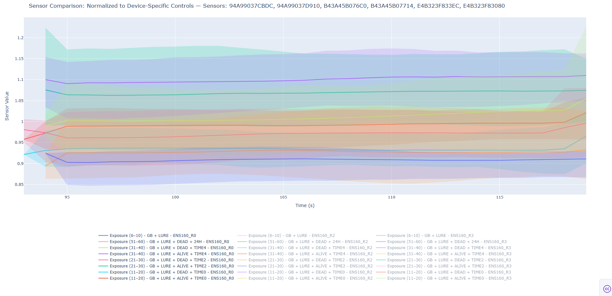

# Data playground for bedbugs (and future BugScents projects)

## Operation

- This repo is made up of various tools for analysing and formatting data for SentryIQ testing
- Generally, if it's a `main-*.py` file in this folder then it's a tool, with utility functions within `utils/`

### Create Referenced Files

- **Purpose:** Normalize sensor readings to device-specific controls and save per-scenario CSVs.  
- **Devices:** Configurable via `DEVICE_IDS`.
- **Data Processing:**
  - Use last "EMPTY PETRI DISH" file as reference for normalization.  
  - (optional) Use a custom normalization function (default is just division)
  - (optional) Take only the last N samples (`SHOW_ONLY_LAST_N_SAMPLES`).  
  - (optional) Drop unnecessary columns (`scenario`, `device_id`, `_R1`).
- **Output:**  
  - Creates one CSV per device per scenario in `./data/20250813 - DEAD BEDBUG/referenced/`.  
  - Scenario names are sanitized for file naming.  
- **Run:**  
  - Execute the script via `python main-create_referenced_files.py` to automatically generate all referenced CSV files

### Plot Multiple Devices

- **Purpose:** Load, process, and visualize sensor data for multiple devices.  
- **Devices:** Set `DEVICE_IDS` to select which devices to analyze.  
- **Data Processing:**
  - Optionally normalize readings using last "EMPTY PETRI DISH" control files.  
  - Drop unnecessary columns (`BME688`, `SGP41`, `_R1`).  
  - Take only the last N samples (`take_last_n_samples`).  
  - Apply moving average to smooth sensor readings.  
- **Visualization:**  
  - Interactive dashboard created with `create_per_device_app` or `create_grouped_app`.  
  - Can show raw lines or averaged bands for comparison across devices.  
- **Run:**  
  - Execute the script via `python main-plot_multiple_devices.py` to launch the web dashboard  

  

  What this graph shows us, is (in order of vertical apperance, start from the top):
  - ——— Exposure (31-40) Bedbugs Alive (4)
  - ——— Exposure (21-30) Bedbugs Alive (2)
  - ——— Exposure (31-40) Bedbugs Dead (4)
  - ——— Exposure (11-20) Bedbugs Alive (0)
  - ——— Exposure (21-30) Bedbugs Dead (2)
  - ——— Exposure (11-20) Bedbugs Dead (0)
  - ——— Exposure (51-60) Bedbugs Dead @ 24h
  - ——— Exposure (6-10) No bedbugs
  
  However it also shows a lot of spread, which means we either:
  - Need to tailor the sensor's temperatures to more specifically pick up bedbug VOCs
  - Need to improve our referencing algorithm (i.e. not just a simple division only)
  - Need to potentially burn in our sensors more
  - ..others ideas?

### Plot Single Device

- **Purpose:** Load, process, and visualize sensor data for a single device.  
- **Device:** Set `DEVICE_ID` to select which device to analyze.  
- **Data Processing:**
  - Normalize readings using control files (empty petri dish).  
  - Drop unnecessary columns (`BME688`, `SGP41`, `_R1`).  
  - Take only the last N samples (`take_last_n_samples`).  
  - Apply moving average to smooth sensor readings.  
- **Visualization:**  
  - Interactive dashboard created with `create_per_device_app`.  
  - Shows sensor comparison over time.  
- **Run:**  
  - Execute the script via `python main-plot_single_device.py` to launch the web dashboard  
